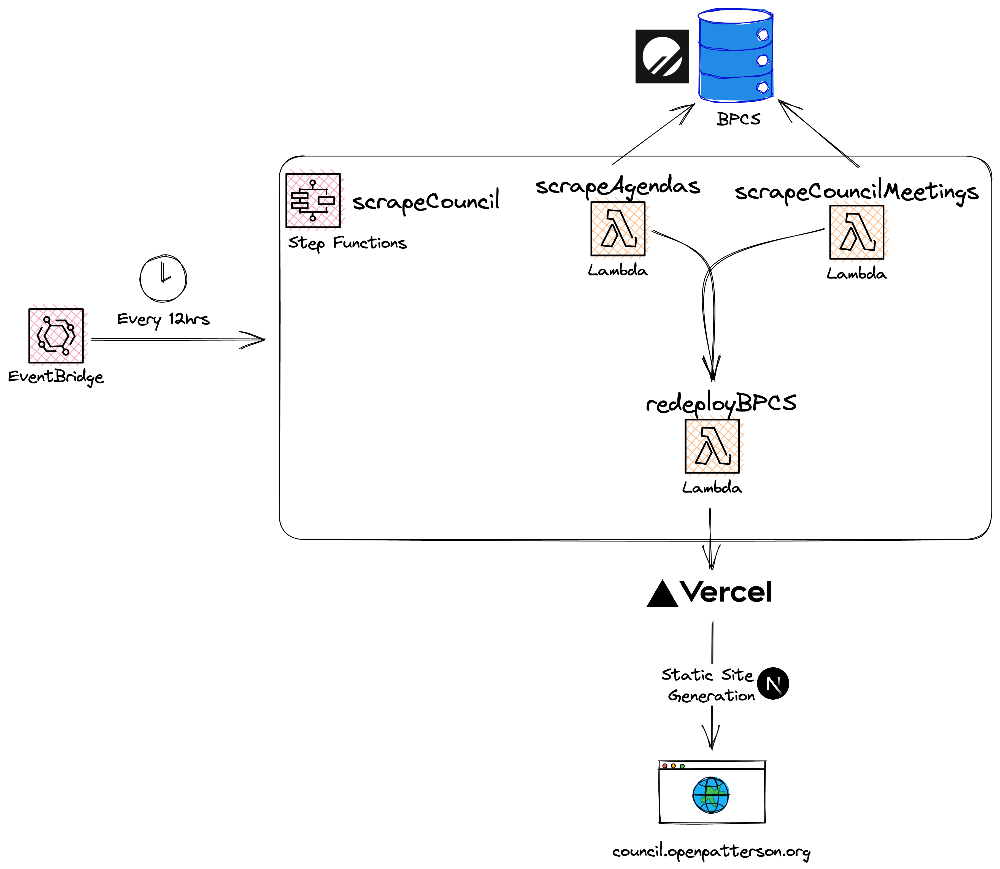

# bpcs-backend
  

These Go programs are used to scrape different data. They are deployed to AWS Lambda.  

- scrapeMeetings: Scrapes meeting times, links, other meeting info to then push them into the Planetscale DB. It only does it for the current year.
- scrapeAllmeetings: Does the same as scrapeMeetings, but for all existing meetings, even prior to the current year.
- scrapeAgendas: Scrapes the agendas for each meeting of the current year to, converts them to markdown, and pushes them to the Planetscale DB.
- redeployBPCS: Used to redeploy the latest version of BPCS in the main branch after data has been scraped.  

The front-end can be found in the [BPCS Repo](https://github.com/OpenPatterson/bpcs)
